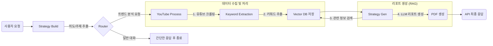

# Trend-Mirror

TrendMirror는 최신 트렌드를 분석하고, 관련 정보를 수집하여 비즈니스/마케팅 전략 보고서를 생성하는 AI 에이전트 프로젝트입니다. 사용자의 요청을 분석하여 의도를 파악하고, YouTube와 같은 소셜 채널의 데이터를 수집/분석하여 RAG(Retrieval-Augmented Generation)를 통해 신뢰도 높은 리포트를 생성합니다.

## 🚀 주요 기능

-   **의도 분석 및 슬롯 추출**: 사용자의 자연어 요청을 분석하여 '트렌드 분석'과 같은 의도(`intent`)와 분석에 필요한 핵심 정보(`slots` - 주제, 기간 등)를 추출합니다.
-   **YouTube 트렌드 데이터 수집**: `search_query`를 기반으로 YouTube에서 최신 트렌드와 관련된 동영상을 수집하고 분석합니다.
-   **키워드 추출 및 빈도 분석**: 수집된 데이터(제목, 설명)에서 LLM을을 활용하여 핵심 트렌드 키워드를 추출하고, 빈도수를 계산하여 저장합니다.
-   **RAG 기반 리포트 생성**: ChromaDB에 저장된 벡터 데이터를 기반으로, 사용자의 질문과 관련된 정보를 검색하고 Upstage Solar LLM을 활용하여 종합적인 분석 리포트를 생성합니다.
-   **PDF 보고서 자동 생성**: 생성된 텍스트 리포트를 바탕으로 PDF 파일을 자동으로 생성하여 제공합니다.
-   **FastAPI 기반 API 제공**: 에이전트의 모든 기능은 RESTful API 엔드포인트 (`/api/v1/chat`)를 통해 외부에서 쉽게 사용할 수 있습니다.

## ⛓️ 핵심 워크플로우

TrendMirror는 LangGraph를 기반으로 여러 에이전트(서브그래프)가 유기적으로 협력하여 사용자의 요청을 처리합니다. 전체 워크플로우는 다음과 같습니다.



1.  **`[Strategy Build]` - 의도 분석 및 계획 수립**
    *   사용자의 초기 입력을 받아 LLM을 통해 `intent`(의도)와 `slots`(핵심 정보)를 추출합니다.
    *   **의도**: `trendmirror`(트렌드 분석) 또는 `chitchat`(단순 대화)으로 분류합니다.
    *   **슬롯**: `domain`(구체적 주제)과 `search_query`(DB 검색 및 크롤링에 사용될 핵심 카테고리) 등을 추출합니다.

2.  **`[Router]` - 작업 분기**
    *   `strategy_build`에서 파악된 의도에 따라 다음 작업을 결정합니다.
    *   `chitchat`일 경우: 간단한 응답 후 워크플로우를 종료합니다.
    *   `trendmirror`일 경우: 데이터 처리 단계로 이동합니다.

3.  **`[YouTube Process]` - 데이터 수집**
    *   `slots`에 담긴 `search_query`를 사용하여 `youtube_crawling_tool`을 호출합니다.
    *   최신 트렌드를 반영하기 위해, 지정된 기간(`days`)과 페이지 수(`pages`)만큼 YouTube 동영상을 검색하여 원본 데이터(CSV)를 저장합니다.

4.  **`[Keyword Extraction]` - 키워드 추출 및 저장**
    *   수집된 YouTube 데이터(제목, 설명)를 LLM에 전달하여 핵심 트렌드 키워드를 추출합니다.
    *   추출된 키워드의 빈도수를 계산하고, `(SNS, 카테고리, 날짜)`를 기준으로 Vector DB(ChromaDB)에 임베딩과 함께 저장합니다. 이 데이터는 나중에 RAG의 기반이 됩니다.

5.  **`[Strategy Gen]` - RAG 기반 리포트 생성**
    *   사용자의 최종 질문과 `search_query`(`category`)를 바탕으로 DB에서 가장 관련성 높은 키워드와 문서들을 검색(Retrieve)합니다.
    *   검색된 데이터를 풍부한 컨텍스트로 재구성하여 Solar LLM에 전달하고, 종합적인 트렌드 분석 리포트 생성을 요청(Generate)합니다.
    *   생성된 텍스트 리포트는 PDF 파일로 변환되어 `reports/` 디렉토리에 저장됩니다.

6.  **`[Final Response]` - 최종 응답**
    *   생성된 리포트 내용과 PDF 파일 경로를 API 응답으로 사용자에게 반환합니다.

## ⚙️ 기술 스택

-   **Backend**: FastAPI, Uvicorn
-   **AI/LLM**: LangGraph, LangChain, Upstage Solar, ChromaDB
-   **Package Management**: uv
-   **Others**: Pydantic, python-dotenv

## 📁 프로젝트 구조

```
.
├── .env.example        # 환경 변수 예시 파일
├── .gitignore
├── app/                # 핵심 애플리케이션 로직
│   ├── main.py         # FastAPI 앱 초기화 및 설정
│   ├── agents/         # LangGraph 기반 에이전트 및 워크플로우
│   ├── api/            # API 라우터 및 엔드포인트
│   ├── core/           # DB 연결, LLM 클라이언트, 로거 등 핵심 모듈
│   ├── models/         # Pydantic 스키마
│   ├── repository/     # 데이터베이스 및 외부 API 클라이언트
│   └── service/        # 비즈니스 로직 서비스
├── chroma_tm/          # ChromaDB 데이터 저장소
├── downloads/          # 크롤링 데이터 임시 저장
├── logs/               # 실행 로그
├── reports/            # 생성된 PDF 보고서
├── resources/          # 폰트 등 정적 리소스
├── scripts/            # DB 동기화 등 보조 스크립트
├── main.py             # (현재 사용되지 않음, app/main.py가 메인)
├── pyproject.toml      # 프로젝트 의존성 및 메타데이터
└── README.md
```

## 💿 설치 및 실행 방법

### 1. 프로젝트 복제

```bash
git clone https://github.com/your-username/Trend-Mirror.git
cd Trend-Mirror
```

### 2. 가상 환경 생성 및 활성화

Python 3.12 이상이 필요합니다. `uv` 사용을 권장합니다.

```bash
# uv 설치 (아직 없다면)
pip install uv

# 가상 환경 생성 및 활성화
uv venv
source .venv/bin/activate  # macOS/Linux
# .venv\Scripts\activate   # Windows
```

### 3. 환경 변수 설정

`.env.example` 파일을 복사하여 `.env` 파일을 생성하고, 파일 내에 자신의 API 키를 입력합니다.

```bash
cp .env.example .env
```

```.env
# .env
UPSTAGE_API_KEY="YOUR_UPSTAGE_API_KEY"
YOUTUBE_API_KEY="YOUR_YOUTUBE_API_KEY"
NAVER_CLIENT_ID="YOUR_NAVER_CLIENT_ID"
NAVER_CLIENT_SECRET="YOUR_NAVER_CLIENT_SECRET"
```

### 4. 의존성 설치

`pyproject.toml`에 명시된 라이브러리들을 설치합니다.

```bash
uv sync
```

### 5. 서버 실행

Uvicorn을 사용하여 FastAPI 서버를 실행합니다.

```bash
uvicorn app.main:app --reload --host 0.0.0.0 --port 8000
```

서버가 실행되면 `http://localhost:8000/docs`에서 API 문서를 확인할 수 있습니다.

## 📖 사용 방법

### 1. API를 통한 트렌드 분석 요청

`POST /api/v1/chat` 엔드포인트로 분석하고 싶은 주제를 담아 요청을 보냅니다.

**Curl 예시 (Windows cmd 기준):**

```shell
curl -X POST "http://localhost:8000/api/v1/chat" -H "Content-Type: application/json" -d "{\"query\": \"요즘 유행하는 디저트\", \"thread_id\": \"my_trend_analysis_1\"}"
```
### 2. 스크립트를 이용한 수동 DB 동기화

수집된 키워드 빈도수 CSV 파일이 있는 경우, 아래 스크립트를 사용하여 수동으로 Vector DB에 동기화할 수 있습니다.

```bash
python scripts/sync_trend_db.py [CSV_파일_경로]

# 예시
python scripts/sync_trend_db.py downloads/youtube_디저트_20260114_30d_real_data_keyword_frequencies.csv
```