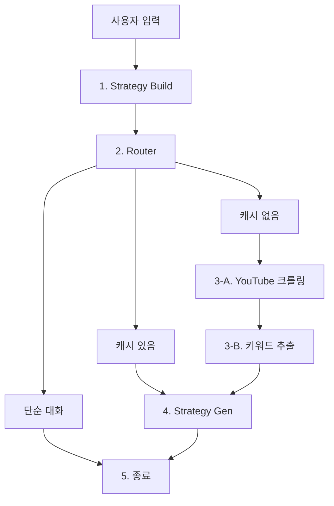

# Trend-Mirror

TrendMirror는 Upstage AI Lab 부트캠프를 위해 제작된 AI 에이전트 프로젝트입니다. 최신 트렌드를 분석하고, 관련 정보를 수집하여 비즈니스/마케팅 전략 보고서를 생성하는 것을 목표로 합니다.

## 🚀 주요 기능

-   **트렌드 분석 및 리포트 생성**: 사용자가 궁금해하는 주제(예: "요즘 유행하는 음식")를 입력하면 관련 최신 PDF 문서를 검색, 다운로드 및 분석하여 Markdown 형식의 리포트와 PDF 파일을 생성합니다.
-   **의도 파악 및 분류**: 사용자의 입력이 트렌드 분석과 관련된 요청인지, 단순한 잡담인지 파악하여 그에 맞는 답변을 제공합니다.
-   **RAG (Retrieval-Augmented Generation)**: Upstage의 Solar LLM과 ChromaDB를 활용하여, 검색된 정보를 바탕으로 신뢰도 높은 답변을 생성합니다.
-   **자동화된 워크플로우**: LangGraph를 기반으로 에이전트들이 유기적으로 협력하여 '의도 파악 → 정보 검색/추출 → 리포트 생성'의 과정을 자동 수행합니다.

## 🤖 워크플로우 (Workflow)


TrendMirror는 LangGraph를 기반으로 한 자율 에이전트 워크플로우를 통해 사용자의 요청을 처리합니다. 전체 과정은 여러 서브그래프(에이전트)들의 협력으로 이루어지며, 각 단계의 결과에 따라 동적으로 다음 경로가 결정됩니다.





---


### **1. 전략 수립 (`strategy_build`)**

-   **상세 동작**: 사용자의 첫 입력을 LLM(Solar)에 전달하여 요청의 의도를 파악합니다. '트렌드 분석' 요청인지, 아니면 '단순 대화(chitchat)'인지 구분하고, 분석에 필요한 핵심 정보(지역, 기간, 목표 등)를 `slots`으로 추출합니다. 또한, 캐싱을 위한 `cache_key`를 생성합니다.

-   **파일 출력**: 없음. 모든 결과는 내부 상태(`TMState`)에 저장됩니다.


### **2. 분기 처리 (`router`)**

-   **상세 동작**: `strategy_build` 단계에서 결정된 `intent` 값에 따라 워크플로우의 다음 경로를 결정하는 분기점입니다.

    -   **단순 대화일 경우**: 바로 워크플로우를 종료하고, 미리 정의된 인사말을 반환합니다.

    -   **캐시된 결과가 있는 경우**: 이전에 동일한 요청으로 생성된 결과가 있다면, 데이터 수집 단계를 건너뛰고 바로 리포트 생성 단계로 이동합니다.

    -   **새로운 분석이 필요한 경우**: `workflow.py`의 라우터 로직에 따라 데이터 처리 에이전트(`youtube_process`)로 이동합니다.

-   **파일 출력**: 없음.


### **3. 데이터 처리 (`youtube_process` & `keyword_extract`)**

`youtube_process` 에이전트는 단일 단계가 아니라, 데이터 수집과 키워드 추출을 순차적으로 관리하는 '중간 관리자' 역할을 합니다.


#### **3-A. YouTube 크롤링 (`youtube_crawling_tool` 호출)**

-   **상세 동작**: `youtube_process` 에이전트 내에서 가장 먼저 실행됩니다. 사용자 요청(`slots`)을 기반으로 `youtube_crawling_tool`을 호출하여 관련 유튜브 영상 정보를 크롤링합니다.

-   **파일 출력**: 크롤링 결과가 임시 **CSV 파일**로 생성됩니다. (예: `.../data/youtube_trend_candidates.csv`)


#### **3-B. 키워드 추출 (`keyword_extract` 서브그래프 호출)**

-   **상세 동작**:

    1.	앞서 생성된 크롤링 결과 CSV 파일을 읽어옵니다.

    2.	영상 제목들을 '유튜브 바이럴 트렌드 분석가' 역할을 하는 LLM(solar-pro)에 전달하여, 마케팅에 적합한 구체적인 트렌드 키워드(신조어, 고유명사 등)를 추출합니다.

    3.	추출된 키워드를 원본 데이터에 `trend_keywords`라는 새 컬럼으로 추가합니다.

-   **파일 출력**: 키워드가 추가된 **새로운 CSV 파일**을 생성합니다. (예: `..._with_keywords.csv`)


*(참고: `insight_extract` 에이전트는 현재 라우팅 로직상 호출되지 않는 대체 데이터 처리 경로입니다. 이 에이전트는 기존 벡터 DB에서 정보를 검색하는 역할을 합니다.)*


### **4. 최종 리포트 생성 (`strategy_gen`)**

-   **상세 동작**:

    1.	이전 데이터 처리 단계(`keyword_extract`)에서 최종적으로 생성된 데이터를 컨텍스트로 사용합니다.

    2.	LLM(Solar)에 이 컨텍스트와 함께 최종 리포트 생성을 요청합니다. 리포트는 요약, 핵심 트렌드, 전략 제안, 결론 등을 포함한 마크다운 형식으로 작성됩니다.

    3.	생성된 마크다운 내용을 `generate_report_pdf` 도구에 전달하여 최종 PDF 파일로 변환합니다.

-   **파일 출력**:

    -   `reports/` 디렉토리에 최종 분석 결과가 담긴 **PDF 파일**이 `report_{요청 주제}.pdf` 형식으로 저장됩니다.


### **5. 종료 (`END`)**

-   **상세 동작**: 생성된 리포트(마크다운 텍스트)와 PDF 파일의 경로를 최종 결과로 반환하고 워크플로우를 마칩니다.

## ⚙️ 시작하기 (Getting Started)

이 섹션에서는 프로젝트를 로컬 환경에서 설정하고 실행하는 방법을 안내합니다.

### 1. 사전 요구사항

- Python 3.12 이상
- [uv](https://github.com/astral-sh/uv): 빠른 Python 패키지 설치 및 관리를 위한 도구

### 2. 환경 설정

프로젝트 루트 디렉토리에 `.env` 파일을 생성하고 필요한 API 키를 입력합니다.

```.env
UPSTAGE_API_KEY="YOUR_UPSTAGE_API_KEY"
YOUTUBE_API_KEY="YOUR_YOUTUBE_API_KEY"
```

### 3. 가상 환경 생성 및 종속성 설치

`uv`를 사용하여 가상 환경을 만들고 `pyproject.toml`에 명시된 종속성을 설치합니다.

```bash
# 1. 가상 환경 생성 (.venv 폴더 생성)
uv venv

# 2. 종속성 설치 (uv.lock 또는 pyproject.toml 기반)
uv sync
```

### 4. 가상 환경 활성화

개발을 시작하거나 서버를 실행하기 전에, 생성된 가상 환경을 활성화해야 합니다. 사용 중인 쉘에 맞는 명령어를 실행하세요.

**Windows (PowerShell):**
```powershell
.venv\Scripts\Activate.ps1
```

**Windows (Command Prompt):**
```cmd
.venv\Scripts\activate.bat
```

**macOS / Linux (Bash, Zsh):**
```sh
source .venv/bin/activate
```
활성화되면 터미널 프롬프트 앞에 `(.venv)`가 표시됩니다.

### 5. 서버 실행

가상 환경이 활성화된 상태에서 다음 명령어를 실행하여 FastAPI 서버를 시작합니다.

```bash
uvicorn app.main:app --reload
```

- `--reload` 옵션은 코드 변경 시 서버를 자동으로 재시작하여 개발에 유용합니다.
- 서버가 정상적으로 실행되면, 브라우저에서 `http://localhost:8000/docs` 로 접속하여 API 문서를 확인할 수 있습니다.

## 📁 프로젝트 구조

```
C:/Users/kwjj0/Trend-Mirror/
├── .gitignore
├── main.py
├── pyproject.toml
├── README.md
├── uv.lock
├── .git/
├── .github/
│   └── workflows/
│       └── main.yml
├── .venv/
├── app/
│   ├── deps.py
│   ├── main.py
│   ├── agents/
│   ├── api/
│   ├── core/
│   ├── models/
│   ├── repository/
│   └── service/
├── chroma_tm/
├── downloads/
├── infra/
├── logs/
├── reports/
├── resources/
└── scripts/
```

## 📄 파일 설명

### 최상위 디렉토리

-   `main.py`: FastAPI 애플리케이션을 실행하는 엔트리포인트입니다. `uvicorn`을 사용하여 서버를 시작합니다.
-   `pyproject.toml`: 프로젝트의 의존성 및 메타데이터를 관리합니다.
-   `.gitignore`: Git 버전 관리에서 제외할 파일 및 디렉토리 목록을 정의합니다.
-   `README.md`: 프로젝트에 대한 설명 문서입니다.

### `app/`

-   `main.py`: FastAPI 앱 인스턴스를 생성하고, CORS 미들웨어, 라우터 등을 설정하는 메인 애플리케이션 파일입니다.
-   `deps.py`: FastAPI의 의존성 주입(Dependency Injection) 시스템을 설정합니다. 각 서비스와 리포지토리의 인스턴스를 생성하고 관리합니다.

#### `app/agents/`

-   `workflow.py`: LangGraph를 사용하여 전체 에이전트 워크플로우(그래프)를 정의하고 컴파일합니다.
-   `state.py`: 워크플로우의 각 단계 간에 데이터를 전달하는 데 사용되는 공유 상태(`TMState`)를 정의합니다.
-   `tools.py`: 에이전트가 사용하는 도구(PDF 다운로드, 문서 파싱, 리포트 생성 등)를 정의합니다. `@tool` 데코레이터를 사용하여 LangChain 도구로 만듭니다.
-   `utils.py`: JSON 파싱, 토큰 수 계산 등 워크플로우 전반에서 사용되는 유틸리티 함수들을 포함합니다.
-   **`app/agents/subgraphs/`**: 각 에이전트의 구체적인 로직을 포함하는 서브그래프들입니다.
    -   `strategy_build.py`: 사용자의 입력을 분석하여 의도(`intent`)와 주요 정보(`slots`)를 추출합니다.
    -   `insight_extract.py`: `strategy_build`에서 추출된 정보를 바탕으로 웹에서 관련 문서를 검색, 다운로드하고 RAG를 위한 데이터베이스를 구축합니다.
    -   `strategy_gen.py`: `insight_extract`에서 처리된 데이터를 바탕으로 최종 트렌드 리포트를 생성하고 PDF로 저장합니다.

#### `app/api/`

-   `routes/chat.py`: `/api/v1/chat` 엔드포인트를 정의합니다. 사용자의 요청을 받아 `AgentService`를 호출하고 결과를 반환합니다.

#### `app/core/`

-   `llm.py`: Upstage LLM(채팅, 임베딩 모델)을 가져오는 함수를 제공합니다.
-   `db.py`: ChromaDB와의 연결을 관리하는 싱글톤 클래스(`ChromaDBConnection`)를 정의합니다.
-   `logger.py`: 프로젝트 전반에서 사용될 로거를 설정합니다. 로그는 콘솔과 날짜별 로그 파일(`logs/`)에 모두 기록됩니다.

#### `app/models/`

-   `schemas/chat.py`: API 요청(`ChatRequest`) 및 응답(`ChatResponse`)의 데이터 구조를 Pydantic 모델로 정의합니다.

#### `app/repository/`

-   `client/base.py`: LLM 및 검색 클라이언트에 대한 추상 기반 클래스(ABC)를 정의합니다.
-   `client/llm_client.py`: Upstage API를 사용하여 채팅 및 임베딩 모델을 가져오는 `UpstageClient`를 구현합니다.
-   `client/search_client.py`: Serper.dev API를 사용하여 웹 검색을 수행하는 `SerperSearchClient`를 구현합니다.
-   `vector/vector_repo.py`: 벡터 데이터베이스(ChromaDB)에 대한 데이터 추가(Upsert) 및 검색(Query) 작업을 수행하는 `ChromaDBRepository`를 구현합니다.

#### `app/service/`

-   `agent_service.py`: 에이전트 워크플로우를 실행하고 그 결과를 반환하는 비즈니스 로직을 담당합니다.
-   `embedding_service.py`: 텍스트를 벡터로 변환하는 임베딩 생성 로직을 담당합니다.
-   `vector_service.py`: `ChromaDBRepository`와 `EmbeddingService`를 사용하여 문서 저장 및 검색과 관련된 비즈니스 로직을 처리합니다.

### 기타 디렉토리

-   `chroma_tm/`: ChromaDB 데이터가 영구 저장되는 디렉토리입니다.
-   `downloads/`: 웹에서 다운로드한 PDF 파일이 임시 저장되는 디렉토리입니다.
-   `logs/`: 날짜별로 에이전트 실행 로그가 저장되는 디렉토리입니다.
-   `reports/`: 생성된 최종 PDF 리포트가 저장되는 디렉토리입니다.

