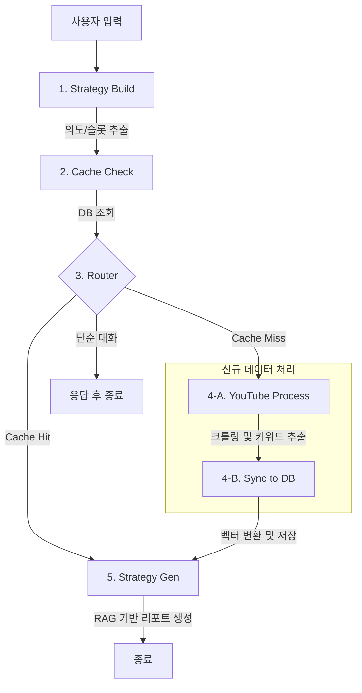

# Trend-Mirror

TrendMirror는 최신 트렌드를 분석하고, 관련 정보를 수집하여 비즈니스/마케팅 전략 보고서를 생성하는 AI 에이전트 프로젝트입니다. 사용자의 요청을 분석하여 의도를 파악하고, YouTube와 같은 소셜 채널의 데이터를 수집/분석하여 RAG(Retrieval-Augmented Generation)를 통해 신뢰도 높은 리포트를 생성합니다.

## 🚀 주요 기능

-   **의도 분석 및 슬롯 추출**: 사용자의 자연어 요청을 분석하여 '트렌드 분석'과 같은 의도(`intent`)와 분석에 필요한 핵심 정보(`slots` - 주제, 기간 등)를 추출합니다.
-   **YouTube 트렌드 데이터 수집**: `search_query`를 기반으로 YouTube에서 최신 트렌드와 관련된 동영상을 수집하고 분석합니다.
-   **키워드 추출 및 빈도 분석**: 수집된 데이터(제목, 설명)에서 LLM을 활용하여 핵심 트렌드 키워드를 추출합니다.
-   **효율적인 캐싱 및 DB 관리**: 분석 요청 시 Vector DB(ChromaDB)의 기존 데이터 존재 여부를 확인하여, 불필요한 데이터 수집을 최소화하고 항상 최신 상태를 유지합니다.
-   **RAG 기반 리포트 생성**: ChromaDB에 저장된 벡터 데이터를 기반으로, 사용자의 질문과 관련된 정보를 검색하고 Upstage Solar LLM을 활용하여 종합적인 분석 리포트를 생성합니다.
-   **PDF 보고서 자동 생성**: 생성된 텍스트 리포트를 바탕으로 PDF 파일을 자동으로 생성하여 제공합니다.
-   **FastAPI 기반 API 제공**: 에이전트의 모든 기능은 RESTful API 엔드포인트 (`/api/v1/chat`)를 통해 외부에서 쉽게 사용할 수 있습니다.

## 🤖 워크플로우 (Workflow)

TrendMirror는 LangGraph를 기반으로 한 자율 에이전트 워크플로우를 통해 사용자의 요청을 처리합니다. 전체 과정은 여러 서브그래프(에이전트)들의 협력으로 이루어지며, 각 단계의 결과에 따라 동적으로 다음 경로가 결정됩니다.



1.  **`[Strategy Build]` - 전략 수립 및 의도 분석**
    -   사용자의 첫 입력을 LLM(Solar)에 전달하여 요청의 의도를 파악합니다. '트렌드 분석' 요청인지, 아니면 '단순 대화(chitchat)'인지 구분하고, 분석에 필요한 핵심 정보(지역, 기간, 목표 등)를 `slots`으로 추출합니다.

2.  **`[Cache Check]` - DB 데이터 확인**
    -   분석에 필요한 데이터가 이미 Vector DB에 존재하는지 확인합니다. 데이터가 완전히 존재하면 `Cache Hit`, 부분적으로 존재하면 분석 기간을 재조정하며, 전혀 없으면 `Cache Miss`로 처리하여 불필요한 데이터 수집을 방지합니다.

3.  **`[Router]` - 작업 분기**
    -   `intent`와 `Cache` 상태에 따라 워크플로우의 다음 경로를 결정합니다.
        -   **단순 대화**: 즉시 종료하고 미리 정의된 답변을 반환합니다.
        -   **Cache Hit**: 데이터 수집 단계를 건너뛰고, DB 정보를 바탕으로 바로 리포트 생성 단계로 이동합니다.
        -   **Cache Miss**: `youtube_process` 서브그래프로 이동하여 데이터 수집 및 분석을 시작합니다.

4.  **`[Data Processing & Sync]` - 데이터 처리 및 동기화**
    -   **4-A (YouTube Process)**: `slots` 정보를 기반으로 YouTube 영상 정보를 크롤링하고, LLM을 통해 핵심 트렌드 키워드를 추출합니다.
    -   **4-B (Sync to DB)**: 추출된 키워드와 영상 데이터를 벡터로 변환하여 ChromaDB에 저장합니다. 이를 통해 DB는 항상 최신 트렌드 정보를 유지합니다.

5.  **`[Strategy Gen]` - 최종 리포트 생성 (RAG)**
    -   `CacheMiss` 경로를 거친 경우 최신 분석 결과를, `CacheHit`인 경우 DB에서 조회한 데이터를 컨텍스트로 사용합니다.
    -   LLM(Solar)에 이 컨텍스트와 함께 최종 리포트 생성을 요청합니다. 리포트는 요약, 핵심 트렌드, 전략 제안, 결론 등을 포함한 마크다운 형식으로 작성됩니다.
    -   생성된 마크다운 내용은 PDF 파일로 변환되어 `reports/` 디렉토리에 저장됩니다.

## ⚙️ 기술 스택

-   **Backend**: FastAPI, Uvicorn
-   **Frontend**: Streamlit
-   **AI/LLM**: LangGraph, LangChain, Upstage Solar, Tavily, ChromaDB
-   **Package Management**: uv
-   **Data Handling**: Pandas, Pydantic

## 📁 프로젝트 구조

```
.
├── .env.example        # 환경 변수 예시 파일
├── start.sh            # 백엔드/프론트엔드 실행 스크립트
├── app/                # 핵심 애플리케이션 로직
...
```

## 💿 설치 및 실행 방법

### 1. 사전 요구사항

-   Python 3.12 이상
-   [uv](https://github.com/astral-sh/uv): 빠른 Python 패키지 설치 및 관리를 위한 도구

### 2. 프로젝트 복제 및 이동

```bash
git clone https://github.com/your-username/Trend-Mirror.git
cd Trend-Mirror
```

### 3. 환경 변수 설정

`.env.example` 파일을 복사하여 `.env` 파일을 생성하고, 파일 내에 자신의 API 키와 설정값을 입력합니다.

```bash
cp .env.example .env
```

```.env
# .env 파일 내용

# --- 필수 API 키 ---
# Upstage API 키 (LLM 및 문서 분석용)
UPSTAGE_API_KEY="YOUR_UPSTAGE_API_KEY"

# YouTube Data API v3 키 (동영상 검색용)
YOUTUBE_API_KEY="YOUR_YOUTUBE_API_KEY"

# Tavily API 키 (웹 검색 기능용)
TAVILY_API_KEY="YOUR_TAVILY_API_KEY"

# --- 선택적 설정 ---
# 로컬 ChromaDB 데이터 저장 경로 (기본값: 'chroma_tm')
CHROMA_PERSIST_PATH="chroma_tm"
```

### 4. 가상 환경 생성 및 종속성 설치

`uv`를 사용하여 가상 환경을 만들고 `pyproject.toml`에 명시된 종속성을 설치합니다.

```bash
# 1. 가상 환경 생성 (.venv 폴더 생성)
uv venv

# 2. 가상 환경 활성화
# macOS / Linux (Bash, Zsh)
source .venv/bin/activate
# Windows (PowerShell)
.venv\Scripts\Activate.ps1

# 3. 종속성 설치
uv sync
```

### 5. 서버 실행

서버를 실행하는 방법은 두 가지입니다.

**방법 1: 스크립트를 사용하여 전체 서비스 실행 (권장)**

프로젝트 루트에서 다음 스크립트를 실행하면 백엔드(FastAPI)와 프론트엔드(Streamlit)가 모두 백그라운드에서 실행됩니다.

```bash
./start.sh
```
-   **백엔드 접속**: `http://localhost:8000`
-   **프론트엔드 접속**: `http://localhost:8002`
-   **로그 확인**: `tail -f app.log ui.log`
-   **종료**: `./stop.sh`

**방법 2: 개발용으로 FastAPI 서버만 직접 실행**

FastAPI 백엔드만 개발 모드로 실행할 때 사용합니다. 코드 변경 시 자동으로 재시작됩니다.

```bash
uvicorn app.main:app --reload --host 0.0.0.0 --port 8000
```
-   서버가 정상적으로 실행되면, 브라우저에서 `http://localhost:8000/docs` 로 접속하여 API 문서를 확인할 수 있습니다.

## 📖 사용 방법

`POST /api/v1/chat` 엔드포인트로 분석하고 싶은 주제를 담아 요청을 보냅니다. `thread_id`는 동일한 대화 세션을 유지하기 위한 식별자입니다.

**cURL 예시:**

```shell
curl -X POST "http://localhost:8000/api/v1/chat" ^
-H "Content-Type: application/json" ^
-d "{\"query\": \"요즘 유행하는 디저트\", \"thread_id\": \"my-analysis-session-1\"}"
```
